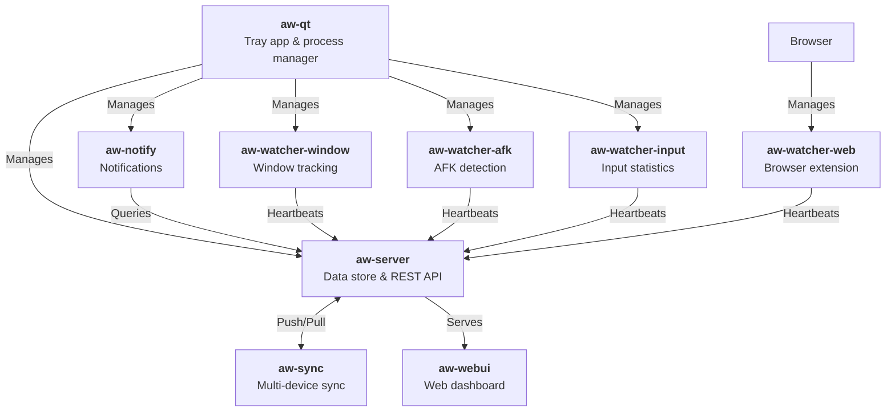

<p align="center">
  
</p>

<p align="center">
  <b>The free and open-source automated time tracker.</b>
  <br>
  Records what you do so that you can <i>know how you've spent your time</i>.
  <br>
  All in a secure way where <i>you control the data</i>.
</p>

<p align="center">
  <a href="https://github.com/ActivityWatch/activitywatch/actions?query=branch%3Amaster">
    
  </a>
  <a href="https://docs.activitywatch.net">
    
  </a>
  <a href="https://github.com/ActivityWatch/activitywatch/releases">
    
  </a>
  <a href="https://github.com/ActivityWatch/activitywatch/releases">
    
  </a>
  <a href="https://discord.gg/vDskV9q">
    
  </a>
  <a href="https://doi.org/10.5281/zenodo.4957165">
    
  </a>
</p>

<p align="center">
  <a href="https://github.com/ActivityWatch/activitywatch">
    
  </a>
  <a href="https://twitter.com/ActivityWatchIt">
    
  </a>
</p>

<p align="center">
  <b>
    <a href="https://activitywatch.net/">Website</a>
    · <a href="https://docs.activitywatch.net">Documentation</a>
    · <a href="https://github.com/ActivityWatch/activitywatch/releases">Downloads</a>
    · <a href="https://forum.activitywatch.net/">Forum</a>
    · <a href="https://discord.gg/vDskV9q">Discord</a>
  </b>
</p>

---

## What is ActivityWatch?

ActivityWatch is an app that **automatically tracks how you spend time on your computer**. It records:

- **Active application & window title** — know exactly which app and document you were using
- **Browser tab & URL** — see how much time you spend on each website
- **AFK detection** — tracks keyboard/mouse activity to know when you're actually at the computer

All data stays on **your machine**. No cloud, no accounts, no telemetry. You own it.

## Why ActivityWatch?

| Problem | ActivityWatch's answer |
|---|---|
| Privacy concerns | All data stored locally, open source, fully auditable |
| Manual time tracking | Fully automatic — install and forget |
| Hard to extend | REST API, client libraries, plugin ecosystem |
| Platform lock-in | Windows, macOS, Linux (and Android) |
| Low data resolution | Stores raw events, queryable with a built-in query language |

### Feature comparison

**Basics**

| | Owns data | GUI | Sync | Open source |
|---|:---:|:---:|:---:|:---:|
| **ActivityWatch** | ✅ | ✅ | [WIP][sync], decentralized | ✅ |
| [Selfspy] | ✅ | ❌ | ❌ | ✅ |
| [ulogme] | ✅ | ✅ | ❌ | ✅ |
| [RescueTime] | ❌ | ✅ | Centralized | ❌ |
| [WakaTime] | ❌ | ✅ | Centralized | Clients only |

**Platforms**

| | Windows | macOS | Linux | Android |
|---|:---:|:---:|:---:|:---:|
| **ActivityWatch** | ✅ | ✅ | ✅ | ✅ |
| Selfspy | ✅ | ✅ | ✅ | ❌ |
| ulogme | ❌ | ✅ | ✅ | ❌ |
| RescueTime | ✅ | ✅ | ✅ | ✅ |

**Tracking capabilities**

| | App & Window | AFK | Browser ext. | Editor plugins | Extensible |
|---|:---:|:---:|:---:|:---:|:---:|
| **ActivityWatch** | ✅ | ✅ | ✅ | ✅ | ✅ |
| Selfspy | ✅ | ✅ | ❌ | ❌ | ❌ |
| RescueTime | ✅ | ✅ | ✅ | ❌ | ❌ |
| WakaTime | ❌ | ✅ | ✅ | ✅ | Editors only |

For the complete list of watchers and integrations, see [the documentation](https://docs.activitywatch.net/en/latest/watchers.html).

[sync]: https://github.com/ActivityWatch/activitywatch/issues/35
[Selfspy]: https://github.com/selfspy/selfspy
[ulogme]: https://github.com/karpathy/ulogme
[RescueTime]: https://www.rescuetime.com/
[WakaTime]: https://wakatime.com/

## Installation

Download the latest release for your platform from the [releases page](https://github.com/ActivityWatch/activitywatch/releases).

For step-by-step instructions, see the [getting started guide](https://docs.activitywatch.net/en/latest/getting-started.html).

### Build from source

See the [installing from source guide](https://docs.activitywatch.net/en/latest/installing-from-source.html).

Prerequisites:

- **Python 3.8+** and **pip**
- **Node.js** (for the web UI)
- **Rust toolchain** (optional, for `aw-server-rust`)
- **Poetry** (Python dependency management)

```bash
git clone https://github.com/ActivityWatch/activitywatch.git
cd activitywatch
git submodule update --init --recursive
make build
```

## Architecture



### Components

| Component | Language | Description |
|---|---|---|
| [`aw-server`][aw-server] | Python | Default server — REST API, datastore, and query engine |
| [`aw-server-rust`][aw-server-rust] | Rust | High-performance server implementation (planned default) |
| [`aw-webui`][aw-webui] | TypeScript/Vue | Web dashboard for visualizing activity data |
| [`aw-qt`][aw-qt] | Python | System tray app that manages all components |
| [`aw-watcher-window`][aw-watcher-window] | Python | Tracks active application and window title |
| [`aw-watcher-afk`][aw-watcher-afk] | Python | Detects AFK state from keyboard/mouse input |
| [`aw-watcher-input`][aw-watcher-input] | Python | Collects keyboard/mouse input statistics |
| [`aw-watcher-web`][aw-watcher-web] | JS | Browser extension tracking active tab and URL |
| [`aw-notify`][aw-notify] | Python | Desktop notifications based on activity rules |
| [`aw-core`][aw-core] | Python | Core library with shared data models and utilities |
| [`aw-client`][aw-client] | Python | Client library for the REST API |

[aw-server]: https://github.com/ActivityWatch/aw-server
[aw-server-rust]: https://github.com/ActivityWatch/aw-server-rust
[aw-webui]: https://github.com/ActivityWatch/aw-webui
[aw-qt]: https://github.com/ActivityWatch/aw-qt
[aw-watcher-window]: https://github.com/ActivityWatch/aw-watcher-window
[aw-watcher-afk]: https://github.com/ActivityWatch/aw-watcher-afk
[aw-watcher-input]: https://github.com/ActivityWatch/aw-watcher-input
[aw-watcher-web]: https://github.com/ActivityWatch/aw-watcher-web
[aw-notify]: https://github.com/ErikBjare/aw-notify
[aw-core]: https://github.com/ActivityWatch/aw-core
[aw-client]: https://github.com/ActivityWatch/aw-client

### REST API

The server exposes a REST API with:

- **Buckets API** — create, retrieve, and delete data buckets (containers for related activity data)
- **Events API** — read and write timestamped events within buckets
- **Heartbeat API** — watchers send heartbeat signals to update current activity state
- **Query API** — built-in query language for filtering, merging, grouping, and transforming events
- **Export** — export activity data in JSON format (individual buckets or complete datasets)

Client libraries: [`aw-client`](https://github.com/ActivityWatch/aw-client) (Python), [`aw-client-js`](https://github.com/ActivityWatch/aw-client-js) (JS), [`aw-client-rust`](https://github.com/ActivityWatch/aw-server-rust/tree/master/aw-client-rust) (Rust)

### Web UI

The built-in web dashboard ([`aw-webui`](https://github.com/ActivityWatch/aw-webui)) provides:

- **Activity timeline** — visual overview of your day with app usage breakdowns
- **Query explorer** — write and execute queries in the browser
- **Category rules** — define custom categories to group activities
- **Raw data browser** — inspect individual events across all buckets

## About this repository

This is the **bundle repository** that brings all ActivityWatch components together via git submodules. It serves as:

- A **meta-package** for building and packaging the full suite
- The home of **release artifacts** ([releases page](https://github.com/ActivityWatch/activitywatch/releases))
- A central place for **cross-cutting concerns** (CI, packaging scripts, integration tests)

### Quick developer commands

```bash
make build          # Build everything (installs Python modules, builds web UI)
make test           # Run test suite across all submodules
make lint           # Lint all submodules
make typecheck      # Type-check all submodules
make update         # Pull latest and rebuild
make clean          # Remove build artifacts
```

Set `AW_EXTRAS=true` to also build `aw-notify` and `aw-watcher-input`. Set `SKIP_SERVER_RUST=true` to skip the Rust server.

## Interactive walkthrough

Explore the codebase interactively on [CodeCanvas](https://www.code-canvas.com/?session=unauthenticatedGithub&repo=activitywatch&owner=Abdulnaser97&branch=master&OnboardingTutorial=true).


## Contributing

Contributions are welcome! See [CONTRIBUTING.md](./CONTRIBUTING.md) for guidelines.

Good places to start:

- Issues labeled [`good first issue`](https://github.com/ActivityWatch/activitywatch/issues?q=is%3Aissue+is%3Aopen+label%3A%22good+first+issue%22) or [`help wanted`](https://github.com/ActivityWatch/activitywatch/issues?q=is%3Aissue+is%3Aopen+label%3A%22help+want+help%20wanted%22)
- [Requested features](https://forum.activitywatch.net/c/features) on the forum
- Writing new watchers or tools for the ecosystem

## Questions & support

- 💬 [Discord](https://discord.gg/vDskV9q) — real-time chat
- 📝 [Forum](https://forum.activitywatch.net/) — questions and discussions
- 📧 [Email](mailto:erik@bjareho.lt) — security issues ([PGP key](https://erik.bjareholt.com/erikbjare.asc))

## Support the project

- [Donate](https://activitywatch.net/donate/) — fund development
- [Contributor stats](https://activitywatch.net/contributors/) — see who's building ActivityWatch
- [CI overview](https://activitywatch.net/ci/) — build status at a glance

## License

Licensed under [MPL-2.0](./LICENSE.txt). Free to use, modify, and distribute.

---

<p align="center">
  <sub>Built with ❤️ by <a href="https://activitywatch.net/contributors/">the ActivityWatch community</a></sub>
</p>
